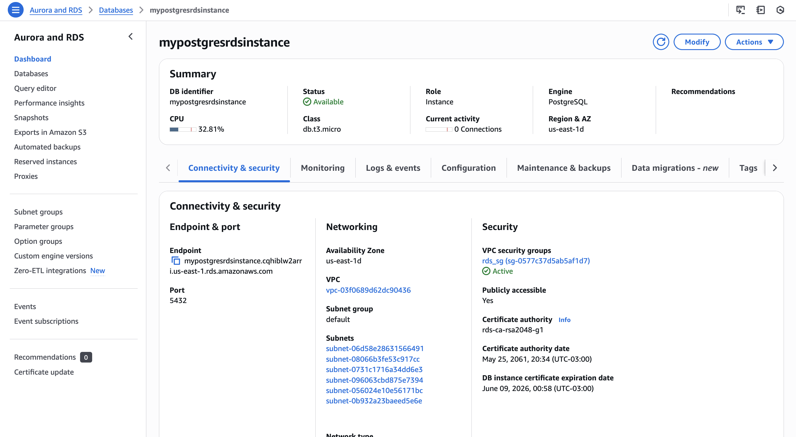

# Infraestrutura como Código

Este projeto demonstra o provisionamento de uma instância do Amazon RDS PostgreSQL utilizando Terraform.

## 🏗️ Arquitetura

O projeto provisiona os seguintes recursos:

- **Security Group**: Controla o tráfego de entrada e saída para o RDS
- **RDS Instance**: Banco de dados PostgreSQL 17.5

## 🚀 Passo a Passo de Execução

### 1. Configuração Inicial - AWS Academy

Antes de executar o Terraform, é necessário iniciar o laboratório no AWS Academy e obter as credenciais:

1. Acesse o portal do AWS Academy
2. Inicie o laboratório clicando em "Start Lab"
3. Aguarde o laboratório ficar ativo (LED verde)
4. Clique em "AWS Details" para obter as credenciais:
   - **Access Key**
   - **Secret Key**
   - **Session Token**
   - **Region**

### 2. Terraform Init

O primeiro comando inicializa o diretório de trabalho do Terraform, baixando os providers necessários.

```bash
terraform init
```

**Propósito**: Inicializar o backend do Terraform e baixar o provider da AWS.


**Resultado**: O Terraform criou o arquivo `.terraform.lock.hcl` e baixou o provider `hashicorp/aws` versão 5.99.1, preparando o ambiente para os próximos comandos.

### 3. Terraform Plan

O comando plan mostra quais recursos serão criados, modificados ou destruídos antes da aplicação.

```bash
terraform plan
```

**Propósito**: Revisar e validar as mudanças que serão aplicadas na infraestrutura antes da execução.


**Resultado**: O plano mostra que serão adicionados 2 recursos:

- 1 Security Group (`aws_security_group.rds_sg`)
- 1 Instância RDS (`aws_db_instance.myinstance`)

O output também mostra os valores que serão disponibilizados após a criação.

### 4. Terraform Apply

O comando apply executa efetivamente as mudanças planejadas na infraestrutura.

```bash
terraform apply
```

**Propósito**: Provisionar os recursos definidos no código Terraform na AWS.


**Resultado**:

- **1 recurso adicionado**, **0 alterados**, **0 destruídos**
- Tempo total de criação: aproximadamente 4m50s
- Outputs gerados:
  - `db_instance_endpoint`: Endpoint de conexão com o banco
  - `security_group_id`: ID do Security Group criado

## 📊 Recursos Provisionados

### Security Group (rds_sg)

- **Nome**: rds_sg
- **Regras de Entrada**:
  - Porta 5432 (PostgreSQL)
  - Protocolo TCP
  - Origem: 0.0.0.0/0 (acesso público)
- **Regras de Saída**:
  - Todas as portas liberadas

### RDS PostgreSQL Instance

- **Identificador**: mypostgresrdsinstance
- **Engine**: PostgreSQL 17.5
- **Classe da Instância**: db.t3.micro
- **Armazenamento**: 20 GB
- **Usuário**: usradmin
- **Acesso Público**: Habilitado
- **Backup**: Skip final snapshot (para ambiente de testes)

### Evidência dos Recursos na AWS



A imagem mostra a instância RDS criada com sucesso no console da AWS, confirmando que o provisionamento foi realizado corretamente.

## 🔧 Arquivos de Configuração

### main.tf

Define o provider AWS e os recursos a serem criados:

- Provider com autenticação via variáveis
- Security Group com regras para PostgreSQL
- Instância RDS PostgreSQL

### variables.tf

Declara as variáveis necessárias:

- `access_key`: Chave de acesso AWS
- `secret_key`: Chave secreta AWS
- `session_token`: Token de sessão AWS
- `region`: Região AWS

### outputs.tf

Define as informações exibidas após o apply:

- `security_group_id`: ID do Security Group
- `db_instance_endpoint`: Endpoint de conexão do RDS
